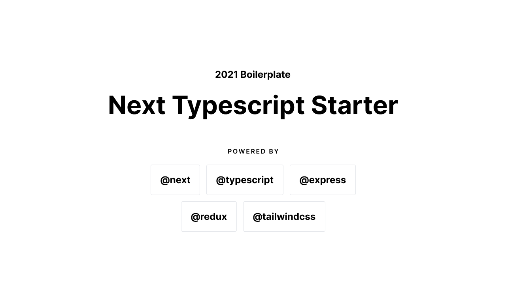

<br />
<br />

<div align="center">Next.js starter template emphasising performance and utilises TypeScript, Express.js, and Tailwind.</div>
<br/>

## About

Next.js gives you the best developer experience with all the features you need for production: hybrid static & server rendering, TypeScript support, smart bundling, route pre-fetching, and more. No config needed. It offers developers an easy way to get started, and as it uses React.js for templating, it's also a straightforward way for developers with React experience to get productive quickly.

This starter template intents to emphasise the development process and help the developer to get up and running with a well-structured Next.js and TypeScript application. 

<br/>

## Install & development
```
yarn

yarn run dev
```

<br />

## Ingredients


next-typescript-starter is packed with a set of features right of the box. Below one will find an overview of the included components and tools.

* **Next.js** - Minimalistic framework for server-rendered React applications.
* **Typescript** - Superset of JavaScript which primarily provides optional static typing, classes and interfaces.
* **Express.js**- A minimal and flexible Node.js web application framework that handles server-side rendering and integrates with Next.js.
* **Tailwind CSS** - A utility-first CSS framework packed with classes that can be composed to build any design.
* **Sass/Scss** - CSS preprocessor, which adds special features such as variables, nested rules and mixins (sometimes referred to as syntactic sugar) into regular CSS.
* **Babel** -  The compiler for next generation JavaScript.
* **ESLint** - The pluggable linting utility.
* **Reverse Proxy** - Lightweight server for proxying API requests.
* **Bundler Analyzer** - Visualize the size of webpack output files with an interactive zoomable treemap.
* **Jest** - Javascript testing framework , created by developers who created React.
* **React Testing Library** - Simple and complete React DOM testing utilities that encourage good testing practices.
* **next-runtime-dotenv** - Expose environment variables to the runtime config of Next.js
* **next-i18next** - An internationalization-framework which provides a function that takes a key, some options, and returns the value for the current language. Helps you to add language translation support to your app.
* **Storybook** - An open source tool for developing UI components in isolation for React.

<br/>

## Commands

All supported commands in `package.json` are prefixed by your preferred package manager through either `npm run` or `yarn run`.

* `dev`. Start the development server.
* `build`. Builds the production application in the .next folder.
* `start`. After a successful build it starts a Node.js server that supports hybrid pages, serving both statically generated and server-side rendered pages.
* `test`. Run all test suites.
* `lint`. Code linting to find problematic patterns or code that does not adhere to the airbnb styleguide.
* `pretty`. Code formatter to format all files the same.
* `analyze`. Build an HTML version of the app and analyze code bundles.
* `export`. Next generates an `.out` directory, which can be served by any static hosting service or CDN.
* `storybook`. Start the Storybook server to work on components in isolation.
* `build-storybook`. Build Storybook as a static web application.

<br/>
